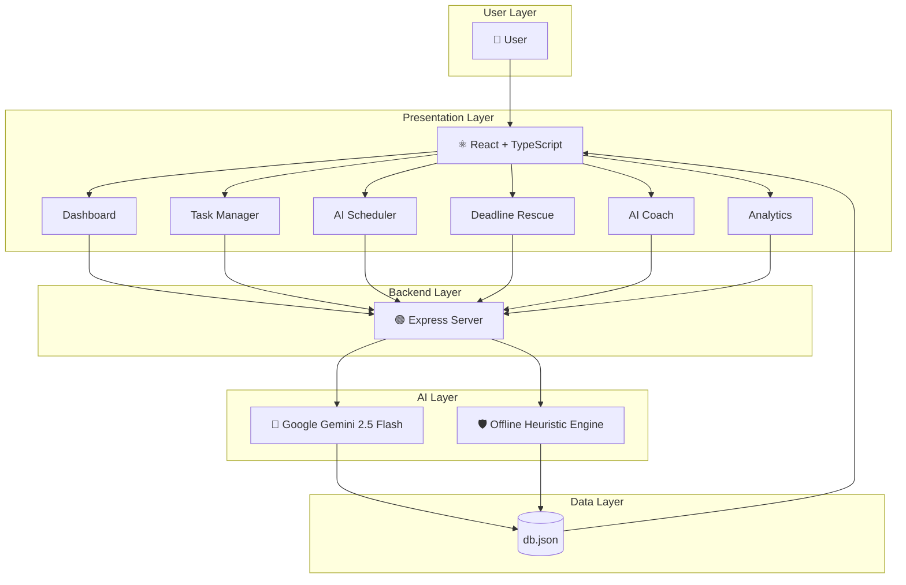
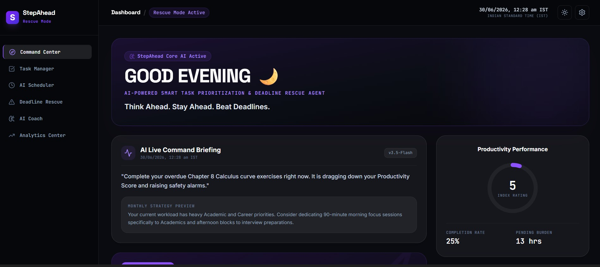
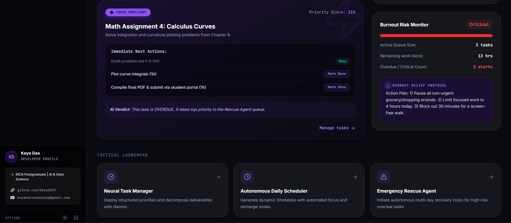
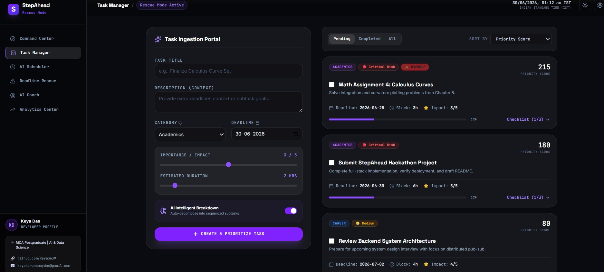
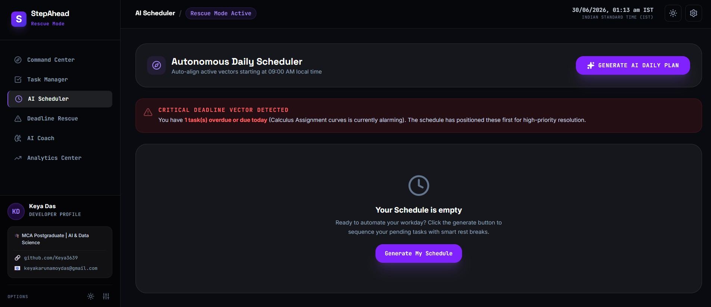
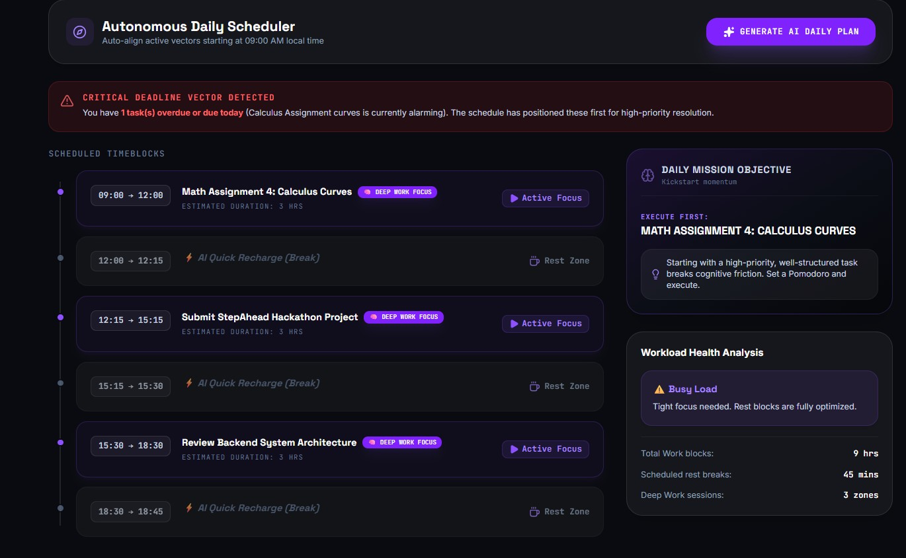
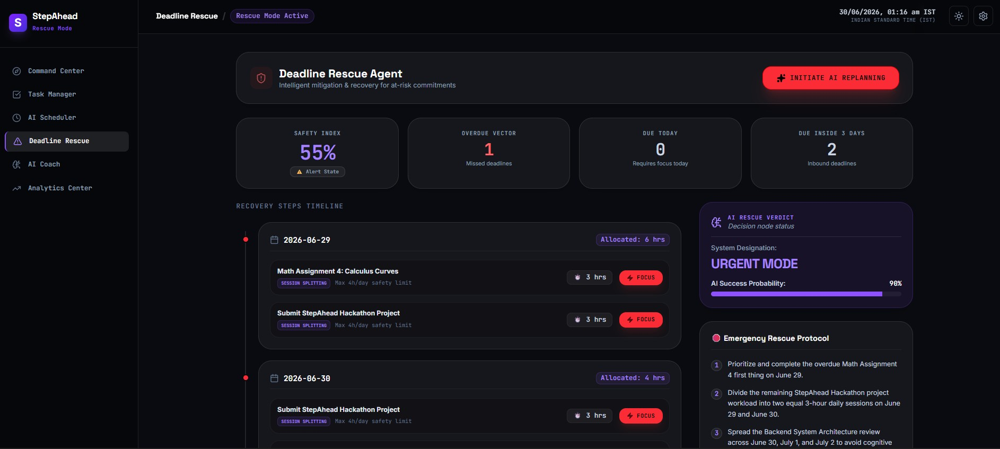
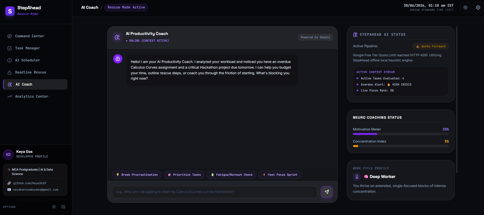
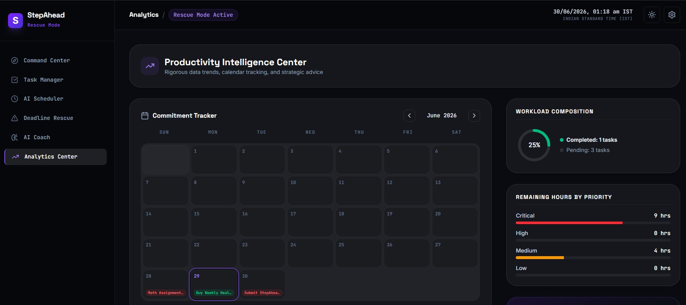
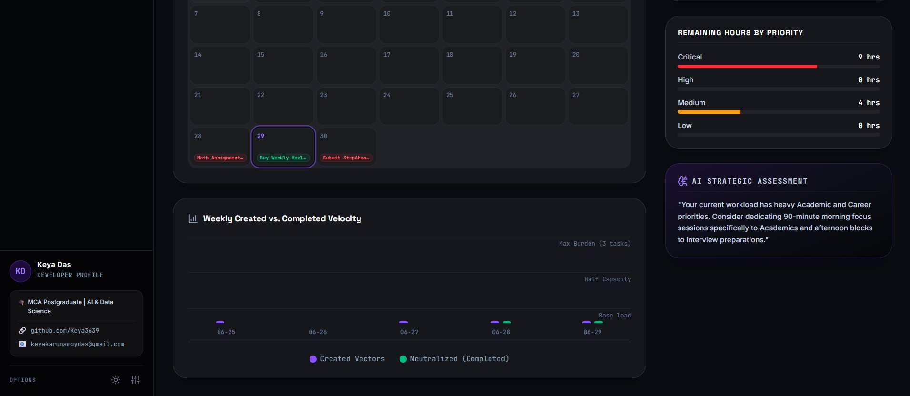

<div align="center">

</div>

# Run and deploy your AI Studio app

This contains everything you need to run your app locally.

View your app in AI Studio: https://ai.studio/apps/35407ee4-dc3a-4237-b61e-5749334ca608

## Run Locally

**Prerequisites:**  Node.js


1. Install dependencies:
   `npm install`
2. Set the `GEMINI_API_KEY` in [.env.local](.env.local) to your Gemini API key
3. Run the app:
   `npm run dev`
---

# 🏗 System Architecture

The architecture of **StepAhead** follows a modular full-stack design where the React frontend communicates with an Express backend, which securely interacts with **Google Gemini AI**. If Gemini becomes unavailable, a local heuristic engine automatically takes over to ensure uninterrupted functionality.





### 🔄 Application Workflow

1. User creates or updates tasks.
2. React sends requests to the Express backend.
3. Backend securely communicates with Google Gemini AI.
4. Gemini generates intelligent responses such as:

   * Task breakdown
   * Priority reasoning
   * Rescue plans
   * Productivity coaching
5. If Gemini is unavailable, StepAhead automatically switches to the local heuristic engine.
6. Updated task information is stored in `db.json`.
7. The frontend refreshes dashboards, analytics, schedules, and AI insights.

---

# 📊 Feature Comparison

StepAhead goes beyond traditional task managers by integrating AI-driven decision support into every stage of productivity.

| Feature                  | Traditional Task Managers |                 StepAhead                |
| :----------------------- | :-----------------------: | :--------------------------------------: |
| AI Task Prioritization   |             ❌             |       ✅ Multi-factor Priority Score      |
| Automatic Task Breakdown |             ❌             |        ✅ Gemini-generated subtasks       |
| Deadline Prediction      |             ❌             |          ✅ Dynamic Safety Score          |
| Emergency Rescue Plans   |             ❌             |     ✅ AI-generated recovery timeline     |
| AI Productivity Coach    |             ❌             | ✅ Context-aware conversational assistant |
| Burnout Monitoring       |             ❌             |         ✅ Smart burnout detection        |
| Intelligent Scheduling   |             ❌             |       ✅ AI-generated daily schedule      |
| Productivity Analytics   |          ⚠️ Basic         |    ✅ Interactive dashboards & insights   |
| Rescue Mode              |             ❌             |       ✅ Dedicated crisis management      |
| Offline AI Fallback      |             ❌             |         ✅ Local heuristic engine         |
| Dark / Light Mode        |         ⚠️ Limited        |         ✅ Built-in theme support         |
| IST Native Time Handling |             ❌             |      ✅ Asia/Kolkata synchronization      |

---

# ✨ Core Features

## 🏠 AI Command Center (Dashboard)

The Dashboard serves as the intelligent control center for the application.

### Highlights

* 🕒 Real-time IST clock
* 👋 Dynamic greeting based on time of day
* 🧠 AI Live Command Briefing
* 🎯 Focus Spotlight for highest-priority task
* 📈 Productivity Performance metrics
* 🔥 Burnout Risk Monitor
* 🧩 Monthly Strategy Preview
* 🚀 Tactical Launchpad
* 🚨 Rescue Mode indicator
* 🌙 Light / Dark Mode support

---

## 📝 Intelligent Task Manager

A smart task management interface that combines manual input with AI assistance.

### Capabilities

* AI-assisted task creation
* Intelligent Breakdown toggle
* Gemini-generated subtasks (3–5 steps)
* Priority Score calculation
* Deadline awareness
* Category management
* Progress tracking
* Pending / Completed filters
* Priority sorting
* Risk classification

### Risk Levels

* 🔴 Critical
* 🟡 Medium
* 🟢 Low

---

## 📅 Autonomous AI Scheduler

Automatically builds an optimized work schedule based on deadlines, duration, and priority.

### Features

* One-click schedule generation
* Smart time blocking
* Cognitive break insertion
* Deadline-aware ordering
* Heavy / Busy / Balanced workload classification
* Empty-state guidance

---

## 🚨 Deadline Rescue Agent

Designed to recover projects before deadlines are missed.

### Includes

* Dynamic Safety Score
* Overdue detection
* Due Today alerts
* Due Within 3 Days monitoring
* Multi-day recovery timeline
* Session splitting
* Daily workload protection
* AI Rescue Verdict
* Emergency Rescue Protocol

---

## 🤖 AI Productivity Coach

A conversational productivity assistant powered by Google Gemini.

### Features

* Context-aware conversations
* Personalized greetings
* Smart suggestion chips
* Motivation Meter
* Concentration Index
* Work Style Profile
* Daily coaching challenges
* Live AI status monitor
* Automatic offline fallback

---

## 📊 Productivity Intelligence Center

Visualizes productivity trends and generates strategic insights.

### Dashboard Components

* 📅 Monthly productivity calendar
* 📊 Weekly Created vs Completed chart
* 📈 Workload composition
* 📉 Priority distribution
* 🧠 AI Strategic Assessment
* 📋 Monthly productivity recommendations

---

StepAhead integrates these modules into a unified ecosystem where every component collaborates to improve productivity, reduce deadline stress, and provide intelligent decision support.

---

# 🤖 Google Gemini AI Integration

At the heart of **StepAhead** is **Google Gemini 3.5 Flash**, enabling intelligent reasoning, contextual understanding, and productivity assistance throughout the application.

Unlike conventional productivity tools that rely on static rules, StepAhead uses **Google Gemini AI** to analyze user tasks, understand context, generate actionable recommendations, and adapt responses dynamically.

The application integrates Gemini using the official **`@google/genai`** SDK through a secure Express backend, ensuring that API keys remain protected and are never exposed to the client.

---

## 🧠 AI Capabilities

| AI Module                    | Description                                                                                |
| :--------------------------- | :----------------------------------------------------------------------------------------- |
| 📝 **Task Breakdown**        | Converts large tasks into 3–5 logical, sequential subtasks.                                |
| 🎯 **Priority Analysis**     | Calculates intelligent Priority Scores based on urgency, importance, and estimated effort. |
| 📋 **AI Command Briefing**   | Generates concise summaries of workload, priorities, and pending actions.                  |
| 📅 **Daily Scheduling**      | Creates optimized work schedules with balanced workloads and strategic breaks.             |
| 🚨 **Deadline Rescue**       | Produces multi-day recovery plans for overdue and high-risk tasks.                         |
| 💬 **AI Productivity Coach** | Provides conversational coaching using the user's actual task context.                     |
| 🔥 **Burnout Detection**     | Detects excessive workload and recommends recovery strategies.                             |
| 📊 **Strategic Assessment**  | Generates AI-powered monthly productivity insights and recommendations.                    |

---

## 🛡 Dual-Pipeline AI Architecture

One of StepAhead's most important design features is its **No-Crash Dual-Pipeline Architecture**.

If Google Gemini becomes temporarily unavailable because of:

* API quota exhaustion
* Network failure
* Missing API configuration
* Temporary service outage

the application **automatically switches** to a deterministic local heuristic engine.

Users can continue working without interruptions.

### AI Status Indicators

| Status                          | Meaning                                                                           |
| :------------------------------ | :-------------------------------------------------------------------------------- |
| 🟢 **StepAhead Core AI Active** | Gemini is operating normally.                                                     |
| 🟡 **Quota Fallback**           | Local heuristic engine is temporarily active because API quota has been exceeded. |
| 🔴 **Offline Heuristic**        | Gemini is unavailable; the application is running entirely on offline logic.      |

This architecture ensures that **the application never crashes or displays blank screens due to AI failures.**

---

## 🌐 Google AI Studio

Google AI Studio played a central role throughout the development lifecycle.

It was used for:

* Gemini API key generation
* Prompt engineering
* Model experimentation
* Gemini 3.5 Flash configuration
* Quota monitoring
* Application deployment

### 🚀 Live Application

> https://ai.studio/apps/35407ee4-dc3a-4237-b61e-5749334ca608

---

# 🛠 Technology Stack

| Layer               | Technology            | Purpose                                                 |
| :------------------ | :-------------------- | :------------------------------------------------------ |
| **Frontend**        | React 18 + TypeScript | Modern component-based user interface                   |
| **Styling**         | Tailwind CSS          | Responsive design, dark theme, utility-first styling    |
| **Build Tool**      | Vite                  | Fast development server and optimized production builds |
| **Backend**         | Node.js + Express.js  | REST API gateway and Gemini proxy                       |
| **AI SDK**          | `@google/genai`       | Official Google Gemini SDK                              |
| **AI Model**        | Gemini 3.5 Flash      | Intelligent reasoning and content generation            |
| **Charts**          | Recharts              | Productivity analytics and visualization                |
| **Database**        | JSON (`db.json`)      | Lightweight storage for tasks and analytics             |
| **Time Management** | Intl.DateTimeFormat   | IST (Asia/Kolkata) synchronization                      |
| **Deployment**      | Google AI Studio      | Application hosting and Gemini integration              |
| **Version Control** | Git & GitHub          | Source code management                                  |

---

# 📂 Project Structure

```text
StepAhead/
│
├── assets/
│   ├── logo.png
│   ├── icons/
│   └── illustrations/
│
├── Screenshots/
│   ├── 1.jpg
│   ├── 2.jpg
│   ├── ...
│   └── 9.jpg
│
├── src/
│
│   ├── components/
│   │
│   ├── AICoachView.tsx
│   │      AI Productivity Coach
│   │
│   ├── AISchedulerView.tsx
│   │      Autonomous Daily Scheduler
│   │
│   ├── AnalyticsView.tsx
│   │      Productivity Intelligence Center
│   │
│   ├── DashboardView.tsx
│   │      AI Command Center
│   │
│   ├── DeadlineRescueView.tsx
│   │      Deadline Rescue Agent
│   │
│   ├── RescueFocusSession.tsx
│   │      Gamified Focus Mode
│   │
│   └── TaskManagerView.tsx
│          Intelligent Task Manager
│
├── App.tsx
├── main.tsx
├── index.css
├── types.ts
│
├── server.ts
├── metadata.json
├── package.json
├── tsconfig.json
├── vite.config.ts
├── index.html
├── .env.example
├── .gitignore
└── README.md
```

---

# 📸 Application Preview
--

## 🏠 AI Command Center (Dashboard)

|   Dashboard Overview   | Productivity Dashboard |
| :--------------------: | :--------------------: |
|  |  |

---

## 📝 Intelligent Task Manager

<p align="center">

</p>

---

## 📅 Autonomous AI Scheduler

|    Smart Scheduling    |  AI Generated Timeline |
| :--------------------: | :--------------------: |
|  |  |

---

## 🚨 Deadline Rescue Agent

<p align="center">

</p>

---

## 🤖 AI Productivity Coach

<p align="center">

</p>

---

## 📊 Productivity Intelligence Center

|   Analytics Dashboard  |  Productivity Insights |
| :--------------------: | :--------------------: |
|  |  |

</p>

---

The screenshots above showcase the primary modules of StepAhead, including intelligent task management, AI-powered scheduling, productivity coaching, deadline rescue workflows, and analytics dashboards.

---
---

# ⚙ Installation & Setup

Follow these steps to run **StepAhead** locally.

## 📋 Prerequisites

Before getting started, ensure you have:

* Node.js **v18 or higher**
* npm (comes with Node.js) or Yarn
* A **Google Gemini API Key** from Google AI Studio

---

## 1️⃣ Clone the Repository

```bash
git clone https://github.com/Keya3639/StepAhead.git

cd StepAhead
```

---

## 2️⃣ Install Dependencies

```bash
npm install
```

---

## 3️⃣ Configure Environment Variables

Create a `.env.local` file in the project root.

```bash
cp .env.example .env.local
```

Add your Gemini API key:

```env
GEMINI_API_KEY=YOUR_GEMINI_API_KEY_HERE
```

---

## 4️⃣ Start the Development Server

```bash
npm run dev
```

The application will launch locally.

Frontend:

```text
http://localhost:5173
```

---

## 5️⃣ Build for Production

```bash
npm run build
```

---

## 🚀 Deploy Using Google AI Studio

StepAhead was deployed using **Google AI Studio**.

Live application:

> https://ai.studio/apps/35407ee4-dc3a-4237-b61e-5749334ca608

---

# 🚀 Demo Workflow

The following workflow demonstrates the application's complete AI pipeline.

|  Step | Action               | Result                                                |
| :---: | :------------------- | :---------------------------------------------------- |
| **1** | Open Dashboard       | AI Command Briefing, Focus Spotlight, Burnout Monitor |
| **2** | Create a Task        | Gemini automatically generates subtasks               |
| **3** | Review AI Analysis   | Priority Score and AI reasoning are generated         |
| **4** | Generate Schedule    | AI builds an optimized daily work schedule            |
| **5** | Open Deadline Rescue | Safety Score and recovery timeline are calculated     |
| **6** | Chat with AI Coach   | Receive personalized productivity coaching            |
| **7** | Open Analytics       | View productivity trends and AI strategic assessment  |

---

# 🌟 Why StepAhead?

Unlike traditional task managers that simply store tasks, **StepAhead** acts as an intelligent productivity companion powered by **Google Gemini AI**.

It helps users:

* 🧠 **Analyze** workloads with AI-driven priority scoring.
* 📅 **Plan** optimized daily schedules automatically.
* 🚨 **Prevent** missed deadlines through proactive risk detection.
* 🎯 **Guide** productivity with personalized AI coaching.
* 📊 **Understand** work patterns using interactive analytics.
* 🛡 **Stay productive** with an automatic offline fallback when AI services are unavailable.

**StepAhead doesn't just manage tasks—it helps users make smarter decisions, stay organized, and complete work on time.**
---

# 🔮 Future Enhancements

The roadmap for StepAhead includes several planned improvements.

| Phase       | Planned Features                                                          |
| :---------- | :------------------------------------------------------------------------ |
| **Phase 1** | Google Calendar integration, Gmail reminder synchronization               |
| **Phase 2** | Voice-to-task creation, Progressive Web App (PWA)                         |
| **Phase 3** | Team collaboration, shared workspaces, collaborative rescue planning      |
| **Phase 4** | Smart notifications, habit tracking, Wear OS integration                  |
| **Phase 5** | AI-powered productivity forecasting using historical behavioral analytics |
| **Phase 6** | Multi-language support and personalized AI productivity profiles          |

---

# 👩‍💻 Developer

## **Keya Das**

**MCA (AI & Data Science)**

### 🔗 GitHub

https://github.com/Keya3639

### 📧 Email

[keyakarunamoydas@gmail.com](mailto:keyakarunamoydas@gmail.com)

---

# 🙏 Acknowledgements

Special thanks to the technologies and communities that made this project possible.

* 🤖 **Google Gemini AI** — Intelligent reasoning and conversational capabilities
* 🚀 **Google AI Studio** — API management, prompt engineering, testing, and deployment
* ⚛ **React** — Frontend framework
* ⚡ **Vite** — Fast development tooling
* 🎨 **Tailwind CSS** — Responsive styling and UI design
* 🟢 **Node.js & Express.js** — Backend infrastructure
* 📊 **Recharts** — Productivity analytics and visualization
* 💙 **TypeScript** — Type-safe application development
* 🌍 **Open Source Community** — Libraries, tools, and inspiration

---


<div align="center">

# 🚀 StepAhead

### Think Ahead. Stay Ahead. Beat Deadlines.

**Built with ❤️ using**

**Google Gemini AI • React • TypeScript • Vite • Tailwind CSS • Node.js • Express**

---


</div>

